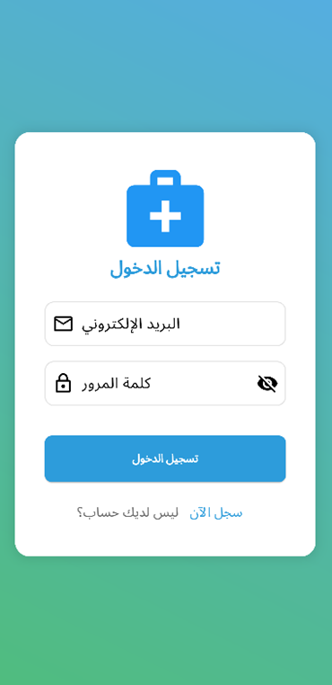
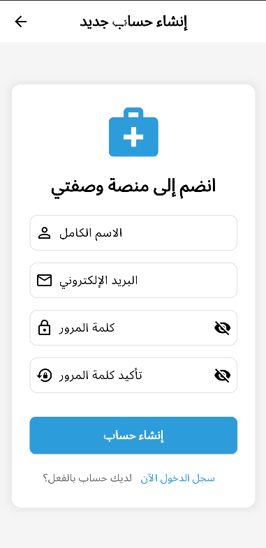
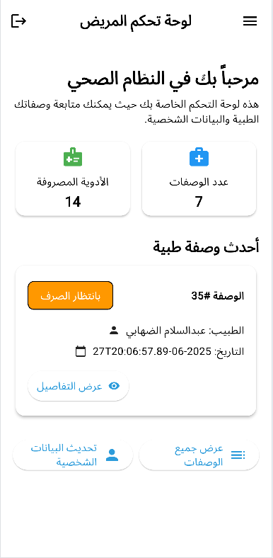
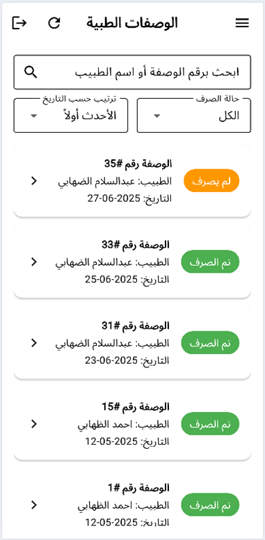
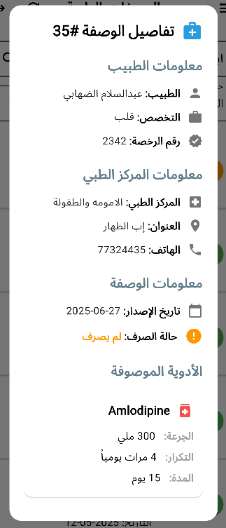
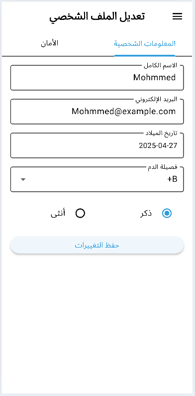
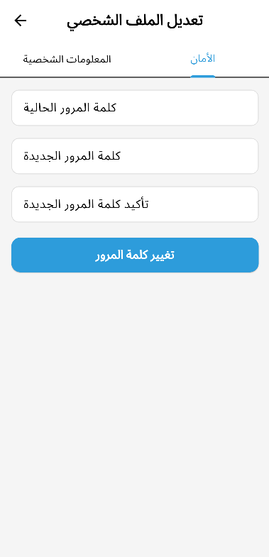

<div align="center">

# 📱 Wasfaty Mobile | وصفتي للهواتف المحمولة
### Patient Mobile Application for Electronic Prescription Management
### تطبيق المريض المحمول لإدارة الوصفات الطبية إلكترونياً

[](https://flutter.dev)
[](https://dart.dev)
[](https://android.com)
[](https://apple.com/ios)

</div>

---

## 📖 Overview | نظرة عامة

| English | العربية |
| :--- | :--- |
| **Wasfaty Mobile** is a dedicated mobile application for **patients** built with **Flutter**. It allows patients to view their medical records, access prescriptions, download PDFs, and manage their profile anytime, anywhere. | **تطبيق وصفتي للهواتف المحمولة** هو تطبيق مخصص **للمرضى** تم بناؤه باستخدام **Flutter**. يتيح للمرضى عرض سجلاتهم الطبية، والوصول إلى الوصفات، وتنزيلها بصيغة PDF، وإدارة ملفهم الشخصي في أي وقت وأي مكان. |

---

## ✨ Key Features | المميزات الرئيسية

| Feature | الميزة |
| :--- | :--- |
| 🔐 **Secure Authentication** | 🔐 **مصادقة آمنة** - تسجيل الدخول وإنشاء حساب مع JWT |
| 📋 **View Prescriptions** | 📋 **عرض الوصفات** - قائمة بجميع الوصفات (مصروفة/معلقة) |
| 📄 **Export to PDF** | 📄 **تصدير كـ PDF** - تحميل الوصفات ومشاركتها |
| 👤 **Profile Management** | 👤 **إدارة الملف الشخصي** - تحديث البيانات وتغيير كلمة المرور |
| 📱 **Cross-Platform** | 📱 **متعدد المنصات** - يعمل على Android و iOS |
| ⚡ **Fast & Responsive** | ⚡ **سريع ومتجاوب** - واجهة مستخدم سلسة ومناسبة للشاشات الصغيرة |

---

## 🛠 Tech Stack | التقنيات المستخدمة

| Category | Technology |
| :--- | :--- |
| **Framework** | Flutter (Google's UI Toolkit) |
| **Language** | Dart |
| **State Management** | Provider / Bloc |
| **API Communication** | HTTP / Dio (RESTful APIs) |
| **PDF Generation** | pdf / printing packages |
| **Local Storage** | Shared Preferences |
| **Authentication** | JWT (JSON Web Tokens) |

---

## 📂 Project Structure | هيكل المشروع

```text
lib/
├── features/
│   ├── auth/
│   │   ├── login_screen.dart      # Patient Login
│   │   └── register_screen.dart   # New Patient Registration
│   │
│   └── patient/
│       ├── widgets/
│       │   ├── edit_profile_screen.dart      # Update personal info
│       │   ├── patient_home_screen.dart      # Main dashboard
│       │   └── prescriptions_screen.dart     # Prescriptions list
│       └── ...
│
├── models/
│   ├── Doctor_model.dart
│   ├── MedicalCenter_model.dart
│   ├── Medication_model.dart
│   ├── Prescription_model.dart
│   ├── PrescriptionItem_model.dart
│   └── User_model.dart
│
├── shared/
│   └── app_theme.dart              # App-wide styling
│
└── main.dart                       # App entry point
```

---

## 📸 App Screenshots | واجهات التطبيق

---

### 1️⃣ Authentication | المصادقة

| Login Screen | Register Screen |
| :---: | :---: |
|  |  |
| *Secure login with email and password* | *Simple form for new patient registration* |
| *تسجيل دخول آمن باستخدام البريد وكلمة المرور* | *نموذج مبسط لإنشاء حساب جديد للمريض* |

---

### 2️⃣ Main Dashboard | الواجهة الرئيسية

| Patient Home Screen |
| :---: |
|  |
| *Recent medications, last prescription, quick access to prescriptions and profile* |
| *الأدوية المصروفة، آخر وصفة، روابط سريعة للوصفات والملف الشخصي* |

---

### 3️⃣ Prescriptions | الوصفات الطبية

| Prescriptions List | Prescription Details |
| :---: | :---: |
|  |  |
| *All prescriptions sorted chronologically with status (Pending/Dispensed)* | *Detailed view with medications, instructions, and PDF download* |
| *جميع الوصفات بترتيب زمني مع الحالة (معلقة/مصروفة)* | *عرض تفصيلي للأدوية والتعليمات مع إمكانية تحميل PDF* |

---

### 4️⃣ Profile Management | إدارة الملف الشخصي

| Edit Profile | Change Password |
| :---: | :---: |
|  |  |
| *Update personal information and blood type* | *Secure password change with current password verification* |
| *تحديث البيانات الشخصية وفصيلة الدم* | *تغيير آمن لكلمة المرور مع التحقق من القديمة* |

---

## 🚀 Installation & Setup | التشغيل والإعداد

### Prerequisites | المتطلبات الأساسية

- Flutter SDK (>=3.0.0)
- Dart (>=3.0.0)
- Android Studio / VS Code
- Back-End API running (see [Back-End Repo](https://github.com/abdo7806/WasfatyProject))

### Steps | الخطوات

```bash
# 1. Clone the repository | استنساخ المستودع
git clone https://github.com/abdo7806/Wasfaty-Mobile.git
cd Wasfaty-Mobile

# 2. Get dependencies | تحميل المكتبات
flutter pub get

# 3. Configure API URL | تعديل رابط الـ API
# Open lib/shared/api_config.dart and update base URL
# افتح ملف lib/shared/api_config.dart وعدّل الرابط

# 4. Run the app | تشغيل التطبيق
flutter run
```

---

## 🔗 Connected Repositories | المشاريع المرتبطة

| Project | Technology | Repository |
| :--- | :--- | :--- |
| **⚙️ Back-End API** | ASP.NET Core | [View Repo](https://github.com/abdo7806/WasfatyProject) |
| **💻 Web Front-End** | HTML, CSS, JS, Bootstrap | [View Repo](https://github.com/abdo7806/WasfatyProject_front-end.git) |
| **📱 Mobile App** | Flutter | هذا المستودع |

---

## 👨‍💻 Developer | المطور

<table align="center">
  <tr>
    <td align="center" width="150">
      
      <br />
      <b>Abdulsalam AL-Dhahabi</b>
    </td>
    <td>
      <p><b>Software Engineer / Full-Stack Developer</b></p>
      <p>Passionate about building scalable digital solutions with a focus on Clean Code. <br> مطور شغوف ببناء حلول برمجية متكاملة وقابلة للتوسع مع التركيز على جودة الكود.</p>
      <p>
        <a href="mailto:balzhaby26@gmail.com"></a>
        <a href="https://linkedin.com/in/abdulsalam-al-dhahabi-218887312"></a>
        <a href="https://github.com/abdo7806"></a>
      </p>
    </td>
  </tr>
</table>

---

<div align="center">

### ⭐ Don't forget to star the repo! | لا تنسى وضع نجمة للمستودع ⭐

**Built with ❤️ using Flutter**

</div>


---
